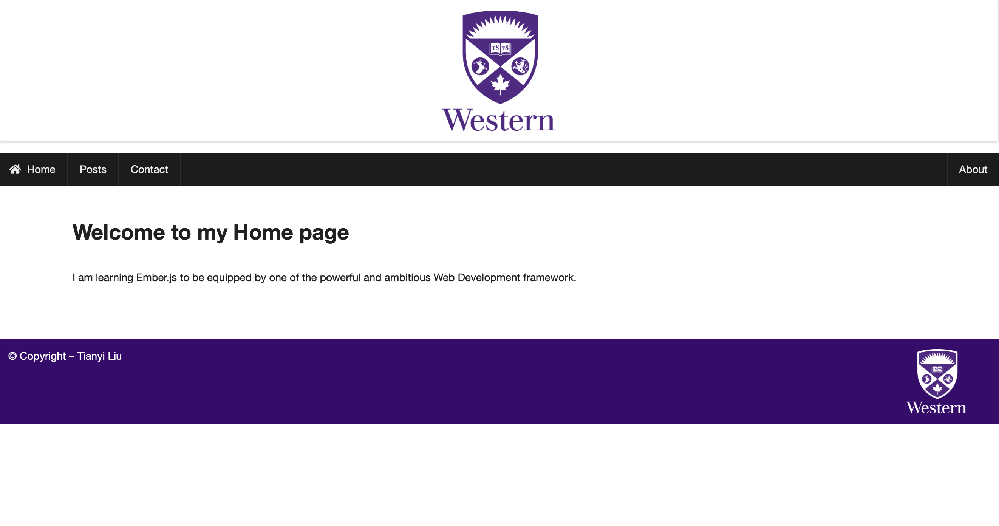
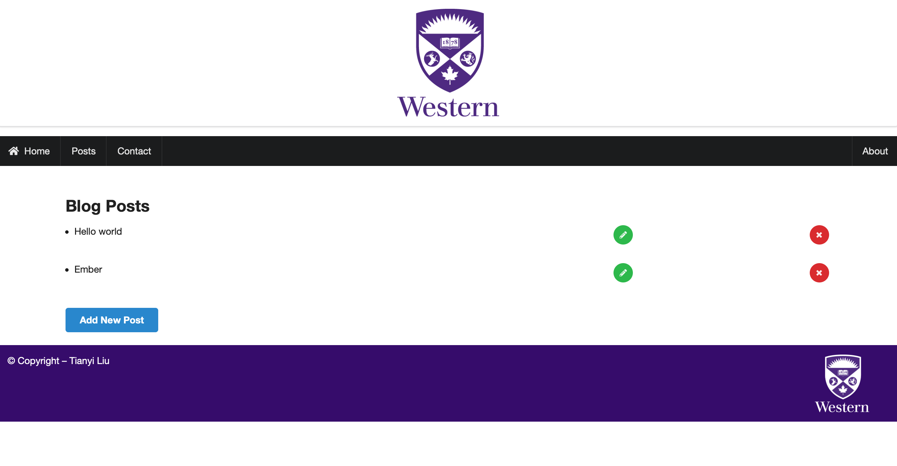
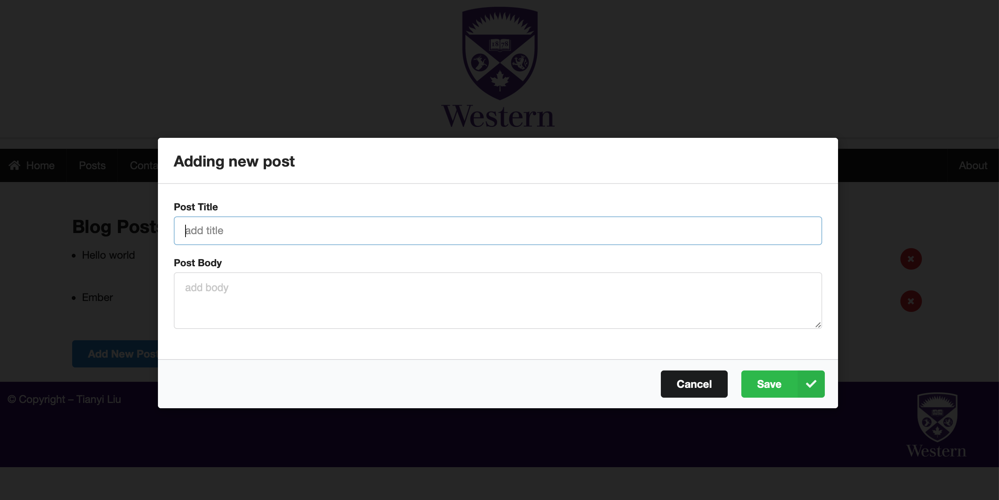
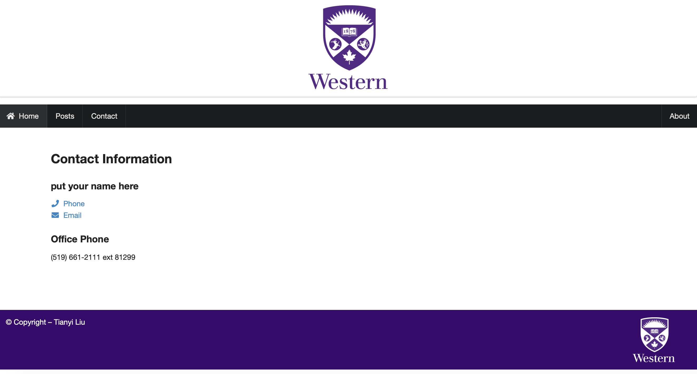

# SimpleEmberWebsite
---------------------------------
A post website using ember.

## Installation
- import the project in WebStrom IDE.
- run `npm install -g ember-cli` for global ember installation
- run `npm install -g bower` for glocal bower installation
- run `bower install semantic-ui` for ui beautify installation
- run `ember serve` to run the project

### Start Page

### Blog Page

### Contact Page

